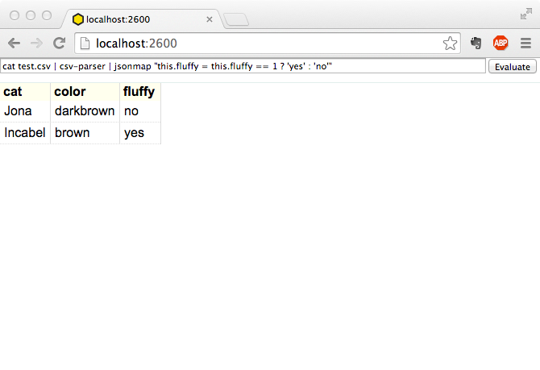

# pipeline-editor

This is a prototype for a UI for creating pipelines and viewing the output. Inspired by Open Refine and
IPython Notebook.

Clone this repo and `npm install` and `npm start` to test it.



Example command: ```cat test.csv | csv-parser | jsonmap "this.fluffy = this.fluffy == 1 ? 'yes' : 'no'"```


## Ideas
- The tool runs in a webbrowser (or atom shell?)
- There is a field, where you can input the UNIX / gasket pipeline
  - e.g. curl random.org | parse | transform
  - However there shoudl be an abstraction layer around it, so that it is more like point and click for the user similar to http://gulpfiction.divshot.io/ 
- Every step in the pipeline might be cached so that it is possible to rerun commands from a certain point (similar to IPython notebook).
   - This would be handy if the source of the data is slow
- The output of the last command in the pipeline should be NDJSON or CSV, which then gets displayed in the UI table
- Since it is mainly for sketching a pipeline, it could by default limit the input stream, so that it's quick to use